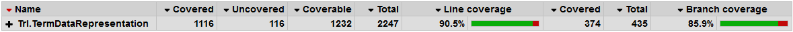

# Description

*NB: Under construction*

_Trl.TermDataRepresentation_ aims to create a compact human readable general-purpose data representation system based on the definition of terms. These _terms_ should be familiar to any programmer because they are basically strings, numbers, and function symbols.

This is exposed as a serialiser and deserialiser to make it useful for most applications.

# Simple example: Deserialization

Input:
```C#
person1 => person<Name,Born>("Socrates", -470);
person2 => person<Name,Born>("Plato", -423);
person3 => person<Name,Born>("Aristotle", -384);

root: (person1, person2, person3);
```

Sample program showing deserialization:

```C#
StringSerializer serializer = new StringSerializer();
var philosophers = serializer.Deserialize<List<Person>>(INPUT_DESERIALIZE);
foreach (var p in philosophers)
{
    Console.WriteLine($"Name = {p.Name}, Born = {p.Born}");
}
```

# Simple example: Serialization

Sample program showing serialization:

```C#
Person[] INPUT_SERIALIZE = new Person[]
{
    new Person { Name = "Socrates", Born = -470 },
    new Person { Name = "Plato", Born = -423 },
    new Person { Name = "Aristotle", Born = -384 }
};

StringSerializer serializer = new StringSerializer();
var philosophers = serializer.Serialize(INPUT_SERIALIZE);
Console.WriteLine(philosophers);
```

Output:

```C#
root: (Person<Born,Name>(-470,"Socrates"),Person<Born,Name>(-423,"Plato"),Person<Born,Name>(-384,"Aristotle"));
```

# Installation via Nuget

See [https://www.nuget.org/packages/Trl.Serialization/](https://www.nuget.org/packages/Trl.Serialization/) for nuget package.

# Unit Test Code Coverage

Unit tests can be run using the `.\test.ps1` script. This will generate a code coverage report in the `.\UnitTestCoverageReport` folder using [Coverlet](https://github.com/tonerdo/coverlethttps://github.com/tonerdo/coverlet) and [ReportGenerator](https://github.com/danielpalme/ReportGenerator).



# Licence

Trl.TermDataRepresentation is released under the MIT open source licence. See LICENCE.txt in this repository for the full text.
